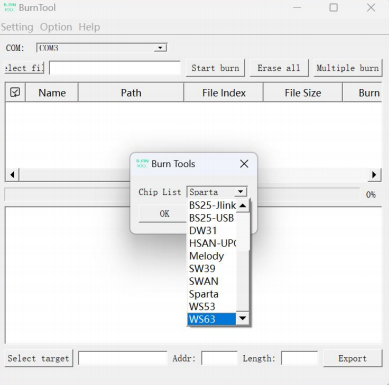
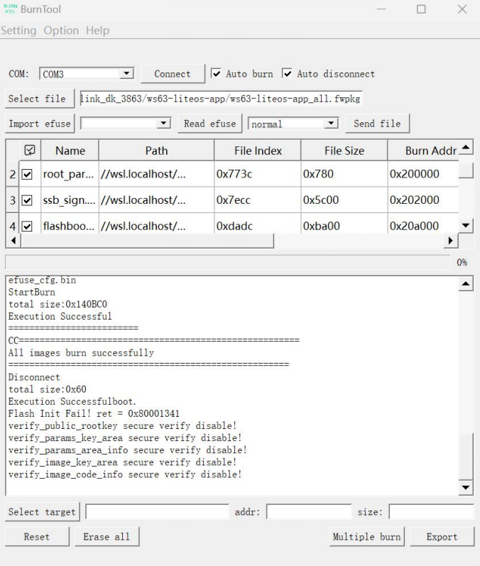
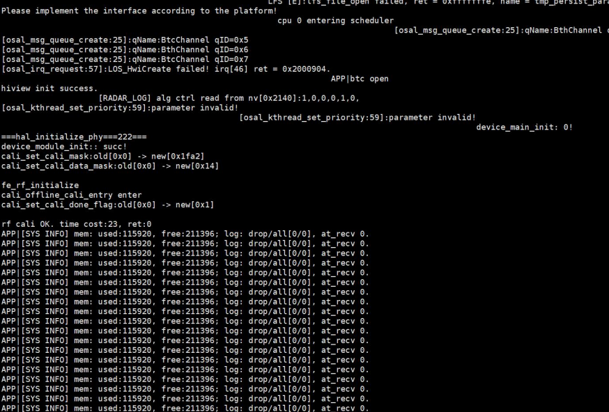

# 星闪代码编译

## 星闪代码下载

- 打开Vscode，在“远程资源管理器”打开“fbb_ws63”子系统

  

- 在“终端”新建一个终端

  


- 在新终端中输入`git clone https://gitee.com/HiSpark/fbb_ws63.git`指令下载代码，等待下载完成。


## 星闪代码导入到VSCode

- 下载完成后,在"资源管理器"中选择打开文件夹

  

- 在弹出框中选择"/root/fbb_ws63/src"目录，点击确定

  

## 星闪代码编译

- 在终端命令行执行指令

  ```
  cd fbb_ws63/src
  ```

- 在src目录下执行对应指令执行对应操作，参数及说明如下

  | 参数        | 示例                                         | 说明                                                 |
  | ----------- | -------------------------------------------- | ---------------------------------------------------- |
  | 无          | python3 build.py ws63-liteos app             | 启动ws63-liteos-app 目标的增量编译。                 |
  | -c          | python3 build.py -c ws63 liteos-app          | 启动ws63-liteos-app 目标的全量编译。                 |
  | menuco nfig | python3 build.py  ws63 liteos-app menuconfig | 启动ws63-liteos-app 目标的 menuconfig 图形配置界面。 |

- Menuconfig 配置，运行“python3 build.py -c ws63-liteos-app menuconfig”脚本会启动 Menuconfig 程 序，用户可通过Menuconfig 对编译和系统功能进行配置

  

- Menuconfig 操作说明如表，在Menuconfig 界面中可输入快捷键进行配置。

  | 快捷键     | 说明                     |
  | ---------- | ------------------------ |
  | 空格、回车 | 选中，反选。             |
  | ESC        | 返回上级菜单，退出界面。 |
  | Q          | 退出界面。               |
  | S          | 保存配置。               |
  | F          | 显示帮助菜单。           |

- 这里以Enable Sample 》Enable the Sample of peripheral》Support BLINKY SAMPLE为例

  
  
- 按“Enter”依次选中，然后在按“ESC”退出，在弹出的对话框按“y”选择yes

  

- 在终端输入“python3 build.py ws63-liteos app”

  ```
  python3 build.py ws63-liteos app
  ```
  
- 等待编译完成，编译成功如下
  
  


## 镜像烧录


- 硬件搭建：Typec线将板端与PC端连接

  

- 安装驱动“CH341SER驱动”（[CH341SER驱动下载地址](https://www.wch.cn/downloads/CH341SER_EXE.html)，**如果该链接失效或者无法下载，用户自行百度下载即可**），安装CH341SER驱动，安装前单板需要与PC端相连，点击安装即可，显示**驱动安装成功代表成功**，如果出现**驱动预安装成功代表安装失败**

    

    

-  下载BurnTool烧录工具并解压。

    ```hljs
    链接：https://gitee.com/hihope_iot/near-link/tree/master/tools
    ```

- 打开烧录工具，选择对应的串口,打开烧录工具,点开Option选项,选择对应的芯 片,WS63E与WS63属于同一款系列，芯片选择WS63即可。

  

  

  

- 选择烧录文件,示例路径为（选ws63-liteos-app-all.fwpkg）

  ```hljs
  F:\ubuntu\rootfs\root\fbb_ws63\src\output\ws63\fwpkg\ws63-liteos-app
  ```
  
- 勾选Auto Burn和Auto disconnect选项,点击connect连接,单按开发板RST按键 开始烧录。

- 烧录完成结果如下：

  
  

  （4） 打开串口工具,波特率选择115200,上电后可以看到相关的串口打印。（用户百度下载串口工具即可，例如：sscom、xshell）

  

## FAQ

-  如果根据文档没有编译成功，请参考https://developer.hisilicon.com/postDetail?tid=02110170392979486020
-  如果根据文档编译成功，但是在编写其他代码后，导致编译失败，可以在论坛提问，论坛链接：https://developer.hisilicon.com/forum/0133146886267870001


​    

  
