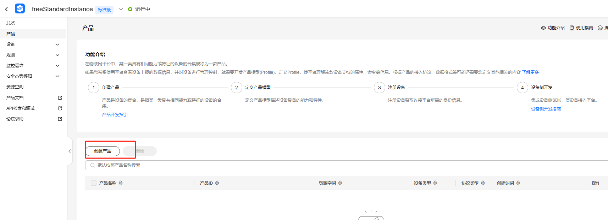
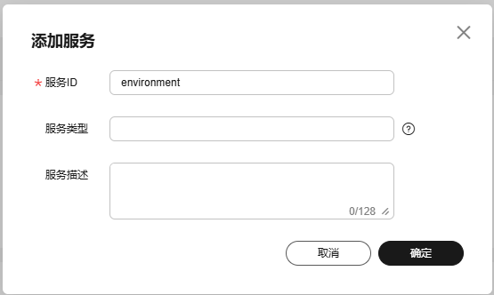
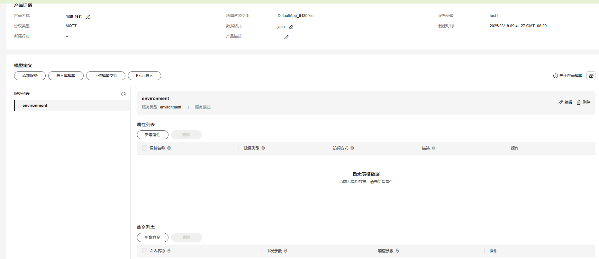
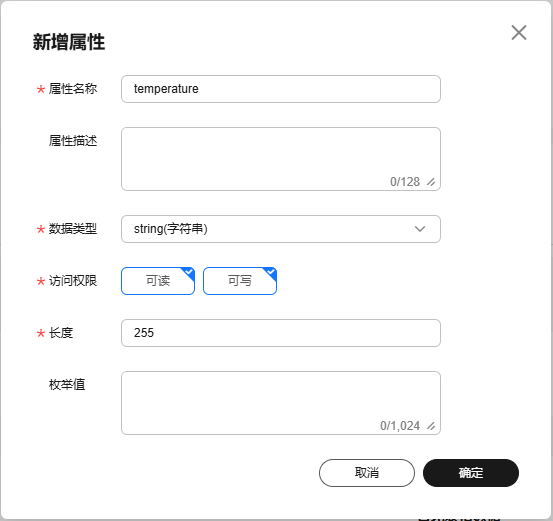
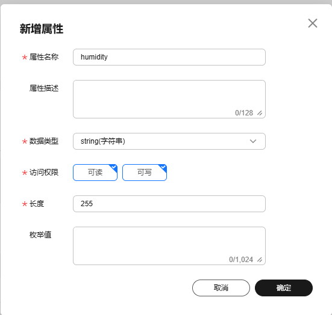
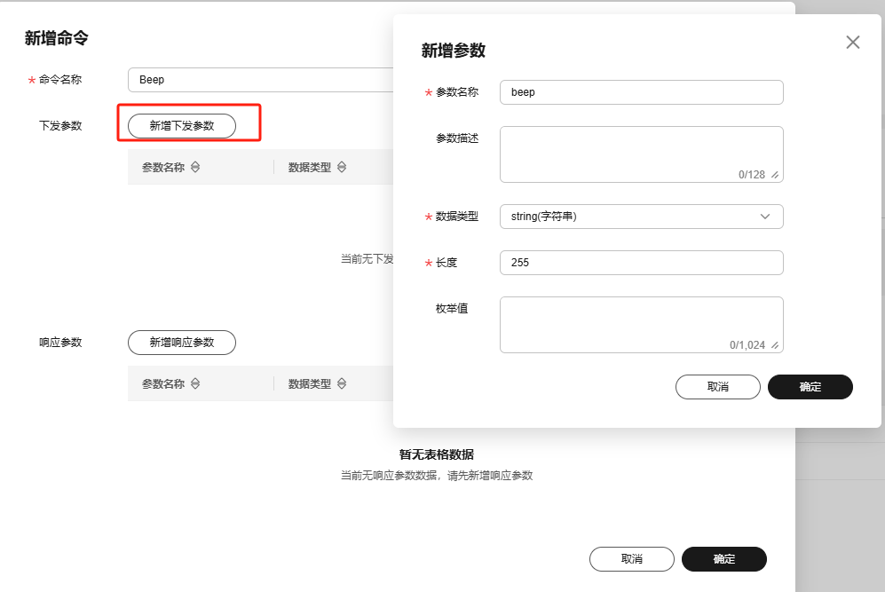
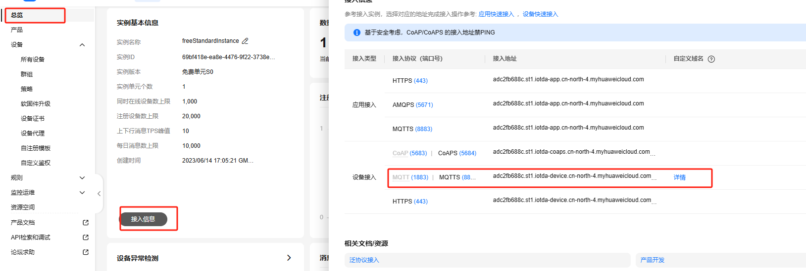
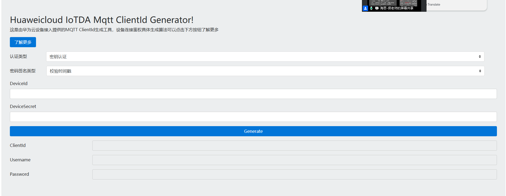

# mqtt

## 1.1 介绍

**功能介绍：** 实现核心板连接路由器热点或者手机热点，案例中手机或者路由器热点需要设置为SSID：H， 密码：12345678。

**硬件概述：** 核心板。硬件搭建要求如图所示：

## 1.2 约束与限制

### 1.2.1 支持应用运行的芯片和开发板

本示例支持开发板：HiHope_NearLink_DK3863E_V03

### 1.2.2 支持API版本、SDK版本

本示例支持版本号：1.10.102

### 1.2.3 支持IDE版本、支持配套工具版本

本示例支持IDE版本号：1.0.0.8；

## 1.3 效果预览

## 1.4 接口介绍

### 1.4.1 wifi_sta_enable()

| **定义：**   | errcode_t wifi_sta_enable(void);                |
| ------------ | ----------------------------------------------- |
| **功能：**   | 开启SoftAP                                      |
| **参数：**   | config：SoftAp的配置                            |
| **返回值：** | ERROCODE_SUCC：成功    Other：失败              |
| **依赖：**   | include\middleware\services\wifi\wifi_hotspot.h |

### 1.4.2 netifapi_netif_set_addr()

| **定义：**   | err_t netifapi_netif_set_addr(struct netif *netif, const ip4_addr_t *ipaddr, const ip4_addr_t *netmask, const ip4_addr_t *gw); |
| ------------ | ------------------------------------------------------------------------------------------------------------------------------ |
| **功能：**   | 设置网络接口的IP地址                                                                                                           |
| **返回值：** | ERROCODE_SUCC：成功    Other：失败                                                                                             |
| **依赖：**   | open_source\lwip\lwip_v2.1.3\src\include\lwip\netifapi.h                                                                       |

### 1.4.3 netifapi_dhcps_start()

| **定义：**   | err_t netifapi_dhcps_start(struct netif *netif, char *start_ip, u16_t ip_num); |
| ------------ | ------------------------------------------------------------------------------ |
| **功能：**   | 启动dhcp服务                                                                   |
| **返回值：** | ERROCODE_SUCC：成功    Other：失败                                             |
| **依赖：**   | open_source\lwip\lwip_v2.1.3\src\include\lwip\netifapi.h                       |

### 1.4.4 wifi_sta_scan()

| **定义：**   | errcode_t wifi_sta_scan(void);                 |
| ------------ | ---------------------------------------------- |
| **功能：**   | 进行全信道基础扫描                             |
| **参数：**   | void类型                                       |
| **返回值：** | ERRCODE_SUCC：成功   Other：失败               |
| **依赖：**   | include\middleware\services\wifi\wifi_device.h |

### 1.4.5 wifi_sta_connect()

| **定义：**   | errcode_t wifi_sta_connect(const wifi_sta_config_stru *config); |
| ------------ | --------------------------------------------------------------- |
| **功能：**   | 进行连接网络                                                    |
| **参数：**   | config：连接的网络参数                                          |
| **返回值：** | ERRCODE_SUCC：成功   Other：失败                                |
| **依赖：**   | include\middleware\services\wifi\wifi_device.h                  |

### 1.4.6 wifi_sta_get_ap_info()

| **定义：**   | errcode_t wifi_sta_get_ap_info(wifi_linked_info_stru *result); |
| ------------ | -------------------------------------------------------------- |
| **功能：**   | 获取station连接的网络状态                                      |
| **参数：**   | result：连接状态                                               |
| **返回值：** | ERRCODE_SUCC：成功   Other：失败                               |
| **依赖：**   | include\middleware\services\radar\radar_service.h              |

## 1.5 具体实现

①调用wifi_sta_enable 、wifi_sta_scan、wifi_sta_connect等函数连接Wi-Fi。

②调用MQTTClient_init、 MQTTClient_create等函数创建一个客户端对象。

③调用MQTTClient_setCallbacks，设置回调函数，客户端进入多线程模式。任何必要的消息确认和状态通信在后台处理，无需任何干预。

④调用MQTTClient_connect连接MQTT服务器

⑤调用mqtt_subscribe，订阅客户需要接收的任何主题。

⑥调用mqtt_publish，发布客户端需要的所有信息，并处理任何信息，重复直到完成。

⑦调用MQTTClient_disconnect断开客户端。

⑧调用MQTTClient_destroy释放客户端正在使用的所有内存。

## 1.6 实验流程

* 步骤1：注册登录华为云账号:https://activity.huaweicloud.com/discount_area_v5/index.html?utm_source=baidu&utm_medium=brand&utm_campaign=10056&utm_content=&utm_term=&utm_adplace=AdPlace024711;
* 步骤2：在搜索栏搜索 ”IoTDA“;

  
* 步骤3：选择 ”免费试用“;

  
* 步骤4：如果是第一次使用，请先实名注册（账户信息实名），然后在选择标准版“开通免费单元”(如果以前有开通基础版也可以继续使用)，在控制台选择 “北京四”，然后点击 “产品”；

  
* 步骤5：选择 “创建产品”，选择自定义类型，然后弹出对话框，根据提示完善信息，点击 “确定”，出现创建产品成功代表产品创建完成。

  

  

  
* 步骤6：创建成功后，可以在页面处看到产品信息，点击 “查看详情”,查看产品详细信息，点击 “自定义模型”创建用户自己的模型

  

  
* 步骤7：创建自定义模型“添加服务”，根据提示完善信息，点击 “确定”，服务添加完成后可以看到如下界面。

  

  
* 步骤8：添加成功后，选择 “新增属性”，如：属性名称：“temperature”，数据类型：“string(字符串)”，访问权限：“可读，可写”，长度：“255”，点击确定；属性名称：“humidity”，数据类型：“string(字符串)”，访问权限：“可读，可写”，长度：“255”，点击确定。

  

  

  

- 步骤9：属性添加成功后，在“新增命令”，如：命令名称：Beep，下发参数：新增下发参数，“参数名称”：beep，”数据类型“：string（字符串）

  

* 步骤10：模型定义完成后，选择左边栏框 “设备”，选择 “所有设备”，然后在点击右上角 “注册设备”，根据弹窗提示完善信息，点击 “确定”，完成设备注册。

  

  
* 步骤11：设备注册成功后，可以看到设备未激活（这是因为设备已经在云端注册，但是实物还没有连接云端），点击 “查看”，查看设备信息。

  

- 步骤12：点击查看，设置“设备名称”

  
- 步骤13：在xxx\src\application\samples\peripheral文件夹新建一个sample文件夹，在peripheral上右键选择“新建文件夹”，创建Sample文件夹，例如名称“mqtt“。

  
- 步骤14：将xxx\vendor\HiHope_NearLink_DK_WS63E_V03\mqtt文件里面内容拷贝到**步骤一创建的Sample文件夹中”mqtt“**。

  

* 步骤15：在xxx\src\application\samples\peripheral\CMakeLists.txt文件中新增编译案例，具体如下图所示（如果不知道在哪个地方加的，可以在“set(SOURCES "${SOURCES}" PARENT_SCOPE)”上面一行添加）。

  

  
* 步骤16：在xxx\src\application\samples\peripheral\Kconfig文件中新增编译案例，具体如下图所示（如果不知道在哪个地方加，可以在最后一行添加）。

  

- 步骤17：修改mqtt_demo.c文件中“ADDRESS”这个字段，将ADDRESS这个字段修改自己设备接入地址，保留tcp://，如：tcp://xxxxxxxxx.com

  
- 步骤18：修改mqtt_demo.c文件中“CLIENTID”、“g_username”、“g_password”三个字段，将下图地方设备ID复制到DeviceId，密钥复制到DeviceSecret，点击Generate生Clientld，Username，Password，替换代码中的三个字段，链接地址：https://iot-tool.obs-website.cn-north-4.myhuaweicloud.com/

  

  
- 步骤19：修改mqtt_demo.c文件中“CONFIG_WIFI_SSID”、“CONFIG_WIFI_PWD”这两个字段，根据自己的手机热点或者路由器热点进行修改
- 步骤20：点击如下图标，选择”**系统配置**“，具体选择路径“Application/Enable the Sample of peripheral”，在弹出框中选择“support MQTT Sample”，点击Save，关闭弹窗。

  
- 步骤21：点击“build”或者“rebuild”编译

  
- 步骤22：编译完成如下图所示。

  
- 步骤23：在HiSpark Studio工具中点击“工程配置”按钮，选择“程序加载”，传输方式选择“serial”，端口选择“comxxx”，com口在设备管理器中查看（如果找不到com口，请参考windows环境搭建）。

  
- 步骤24：配置完成后，点击工具“程序加载”按钮烧录。

  
- 步骤25：出现“Connecting, please reset device...”字样时，复位开发板，等待烧录结束。

  

* 步骤26：烧录完成后，屏幕上显示温湿度，云端网页显示设备在线，并显示对应传感器数据。

